## Einführung und Ziele

### Aufgabenstellung
Für Mitarbeiter in Tierheimen und/oder Tierschutzvereinen stellt die Pflege der Webseite der entsprechenden Organisation einen nicht unwesentlichen Arbeitsaufwand dar. Webseiten-Baukästen wie Jimdo oder Wix bieten zwar eine benutzerfreundliche Oberfläche zur Einbindung von Content, bieten jedoch keine Hilfe um z.B. Artikel von zu vermittelnden Tieren möglichst einheitlich und schnell zu erstellen. Jede Seite muss aufwändig neu erstellt werden, obwohl große Teile davon immer gleich aufgebaut sein sollten. Das führt zu sehr viel Aufwand und Inkonsistenz von Inhalten. Diese Editoren bieten zudem fast zu viel gestalterische Freiheit, so dass von der ursprünglichen Designidee der Webseite nach ein paar Monaten oft nicht mehr viel zu sehen ist.

Sheltify soll eine Oberfläche bieten, die schnelle Verwaltung von Tieren und deren Daten ermöglichen soll. Zudem soll den Contentpflegern alle Tools an die Hand gegeben werden, die sie sich für die Gestaltung der Webseite wünschen und dabei trotzdem das Design auf einem konsistenten Level gehalten werden.

Des Weiteren soll über diese Lösung Geld beim Hosting gespart werden. Da die entsprechenden Seiten meist recht niedrige Aufrufzahlen haben, reicht eine einzelne VPS2 Instanz zum Hosting mehrerer Seiten voraussichtlich absolut aus.

### Ziele
- Schmerzfreie und billig hostbare Lösung zur Pflege mehrerer Websites von Tierheimen und vermittelnden Tierschutzvereinen
- Tiere vermitteln, Spenden sammeln
- Helfer anwerben

### Funktionale Anforderungen

**CMS**
• Content der Webseite und Unterseiten selbst anlegen und bearbeiten können
• Seiten, Artikel, Tiere anlegen und bearbeiten
• Auf individuelle Anforderungen der verschiedenen Organisationen konfigurierbar (manche haben nur Hunde, manche verschiedene Tiere, manche im Ausland, manche in Deutschland etc.)
• Medien hochladen und Größen/Format optimieren
• Update der Webseite mit dem eingepflegten Content anstoßen

**Static Site Generator**
- CMS anfragen und statische Seite daraus bauen

### Qualitätsziele
| Qualitätsziel | Motivation und Erläuterung |
|-|-|
| Einfache Nutzung der CMS-Oberfläche | Die Einfachheit und Effizienz der Einpflegung von neuen Inhalten hat oberste Priorität und muss auch für Nutzer mit begrenztem technischem Hintergrund gut machbar sein. |
| Flexibilität des Seitengenerators | Die Anpassung des Seitengenerators an die Spezifischen Anforderungen jeder Organisation soll einfach möglich sein |
| Ressourcenschonendes Hosting | Speicherplatz, Arbeitsspeicher und Rechenleistung des Hostsystems sollen so wenig wie möglich belastet werden. Es soll möglich sein mehrere, inhaltlich vielfältige Websites auf einem einzelnen VPS2 Server bereitzustellen |

## Stakeholder
Stakeholder, die die Architektur und das System kennen müssen, gibt es außer dem Hauptentwickler (SSE) nicht. Alle weiteren Stakeholder sind ausschließlich Nutzer des Systems ohne technischen Hintergrund.

**Stakeholder**
- **Tierheimmitarbeiter** (technisch nicht bewandert, manchmal Fremdsprachler) können Fotos, Videos und Informationen über die Tiere schnell und einfach hochladen (ohne dass diese direkt auf der Webseite sichtbar sind)
- **Contentpfleger** (technisch nicht bewandert) erwarten eine leicht verständliche Oberfläche zum Bearbeiten der Seiteninhalte und zum Einstellen von Tieren mithilfe der Informationen, Fotos usw. der Tierheimmitarbeiter
- **Entwickler** können mit einfachen Mitteln neue Frontends mit unterschiedlichen Designs bauen, die alle dasselbe CMS benutzen. Diese müssen die Architektur des Gesamtsystems nicht kennen.
- **Besucher** erwarten modern, einfach navigierbare Webseiten mit gutem SEO3 und Mobile First.

## Randbedungungen

### Technisch
- **Betrieb auf einzelnem VPS-Server (Strato)**
Um Kosten zu sparen sind die Ressourcen hier recht begrenzt (derzeit 12MB Ram, 256 GB Speicher)

### Organisatorisch
- **Seiten für 3 organisationen**
Für die drei Organisationen „Streunernothilfe Grenzenlos e.V.“, „Herzenshunde Griechenland e.V.“ und „Menschen für Tiere Spaichingen e.V.“ wird das System benötigt

- **Begrenzte monetäre und personelle Ressourcen**
Ein Entwickler und Betriebskosten sollten möglichst geringgehalten werden (momentan 20€ monatlich für Strato VPS)

## Kontextabgrenzung

**Fachlicher Kontext**
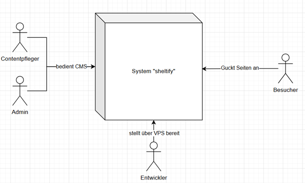

**Technischer Kontext**
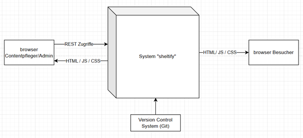

Das System Sheltify bietet den Contentpflegern / Administratoren die Möglichkeit über deren Endgeräte Seiten zu generieren, die Seitenbesucher dann auf deren Endgeräten betrachten können.

## Lösungsstrategie

**Zerlegung**
Das System wird in folgende Komponenten zerlegt
Datenbank
Speichert (Mediendateien) alle für die Seitengenerierung nötigen Daten.

*Backend*
Bietet die Zugriffsschicht auf die Datenbank, legt Mediendateien ab und stellt bietet diese statisch bereit.

*CMS-Oberfläche*
Die Benutzeroberfläche zum Pflegen der Daten (über das Backend) und Anstoßen des Site Generators. Diese wird von Tierheimmitarbeitern und freiwilligen Helfern der jeweiligen Organisation bedient.

*Site Generator*
Generiert aus den vom Backend bereitgestellten Daten statische HTML-Webseiten. Ändern sich die Daten, wird die entsprechende Seite neu gebaut. Da die Änderung von Daten im Normalfall nicht mehr als einmal täglich passiert ist dies wesentlich ressourcenschonender als das dynamische Laden des Contents. Zudem ist Search Engine Optimization3 damit effizienter, als es z.B. bei einer Single Page Application wäre.

*Statische Webseiten*
Diese von Site-Generator generierten Seiten haben selbst haben abgesehen von der Nutzung der statisch bereitgestellten Mediendateien gar keine Verbindung mehr zum Backend.
 
**CMS-System – Eigene Lösung oder System von der Stange?**
Es gibt einige frei verfügbare sogenannte Headless CMS Systeme6, die im Kontext dieses Projektes Datenbank, Backend und CMS-Oberfläche vollständig oder teilweise ersetzen könnten. Konkret wurden hier Strapi für den ersten Prototypen des Systems verwendet und Directus untersucht. Die drei wichtigsten Qualitätsziele sind jedoch mit der Verwendung eines derartigen Systems nicht oder nur über Umwege vereinbar:
Einfache Nutzung der CMS-Oberfläche: Oberflächen existierender Headless CMS Systeme müssen sehr generisch sein und für alle möglichen Datentypen funktionieren. Sie bieten daher inhärent nur wenige Möglichkeiten für spezialisierte Komfortfunktionen, die Contentpflegern die Arbeit erleichtern würden. Eine akkurate und auf die jeweilige Webseite der Organisation zugeschnittene Artikelvorschau ist zum Beispiel kaum umsetzbar.
Flexibilität des Seitengenerators: Der Seitengenerator und dementsprechend auch die zugrundeliegenden Datenstrukturen und CMS-Oberfläche müssen flexibel und an die Bedürfnisse verschiedener Organisationen anpassbar sein. Ein Einfaches Beispiel ist die Auswahl der Tierart. Organisation 1 hat nur Hunde, Organisation 2 hat Hunde, Katzen und Kleintiere, Organisation 3 hat vielleicht nur Hunde und Katzen. Der Inhalt des „Tierart“-Dropdowns muss sich also unterscheiden und für Organisation 1 sogar komplett ausgeblendet werden. Die untersuchten Headless-CMS Systeme können solche Flexibilität nicht, oder nur über so komplizierte Umwege bieten, dass eine eigene spezialisierte Lösung auch hier sinnvoller erscheint.
Ressourcenschonendes Hosting: Aufgrund des geringen Speicherplatzes werden einige Funktionalitäten zur Dateiverwaltung benötigt, die eine eigene Implementierung benötigen. Z.B. automatisches erkennen und löschen ungenutzter Bilder. Zudem steckt Multi-Tenancy zum Untersuchungszeitpunkt für Directus noch in den Kinderschuhen und wird von Strapi gar nicht unterstützt. Es wäre also nötig eine eigene Instanz für jede Organisation zu verwenden, was die Serverlast und Bereitstellungskosten auch erhöhen würde.

Aus diesen Gründen fiel die Entscheidung zugunsten eines eigenen, auf den Nutzungszweck spezialisiertes CMS-System.

**Technologieentscheidungen**
*Datenbank Postgres (oder später MariaDB):*
Bevorzugt und für die aktuelle Implementierung wird Postgres verwendet, da es gute Performance, JSON-Unterstützung und Anbindung an das Backend über Gorm (siehe unten) bietet. Da auf dem Server jedoch bereits MariaDB läuft und Gorm die Datenbank egal sein sollte, wird auch noch ein Betrieb über MariaDB überprüft.

*Backend mit Go und Gorm:*
Go bietet beste Voraussetzungen für einen Ressourcenschonenden Betrieb. Es benötigt keine Runtime, wird zu einer einzelnen (im Vergleich zu Spring oder ASP.Net) kleinen ausführbaren Datei kompiliert und bietet mit Gorm und Chi ein gut entwickeltes Ökosystem für den Datenbankzugriff und Implementierung von Rest APIs.

*CMS-Oberfläche mit Angular*
Angular bietet hervorragende Tools zur Umsetzung einer reaktiven „Single Page Application“ wie es die CMS-Oberfläche sein muss. Zudem hat der Hauptentwickler mit dieser Frontendtechnologie am meisten Erfahrung. 

*Site Generator mit AstroJS*
AstroJS ist eines der beliebtesten Frameworks zur Generierung statischer HTML Seiten. Über das „Islands“ System lässt sich einfach kontrollieren, welche Teile des Codes dabei während der Seitengenerierung und welche im Browser des Nutzers ausgeführt werden. So wird für die generierten Seiten JavaScript nur da ausgeliefert, wo es wirklich nötig ist. Da es auf derselben technischen Grundlage wie Angular basiert (html, css, js/ts) ist es möglich Code mit der CMS-Oberfläche und dem Artikelrenderer (Svelte) zu teilen.

*Artikelrenderer mit Svelte*
Die Darstellung von Artikeln muss sowohl in der CMS-Oberfläche, als auch im Site Generator konsistent sein. Svelte bietet native Anbindung an AstroJS und lässt sich zu Webkomponenten kompilieren, die in der CMS-Oberfläche verwendet werden können. Hierfür wurde auch Angular getestet, dessen Anbindung an AstroJS ist jedoch nicht wirklich ausgereift. In der Basteinsicht ist der Artikelrenderer nicht explizit aufgeführt, da er nur eine von CMS-Oberfläche und Site-Generator genutzte Bibliothek ist.

## Bausteinsicht

**Gesamtsystem**
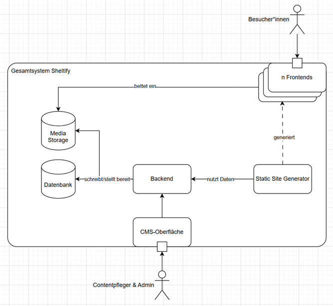

**Baustein Backend**
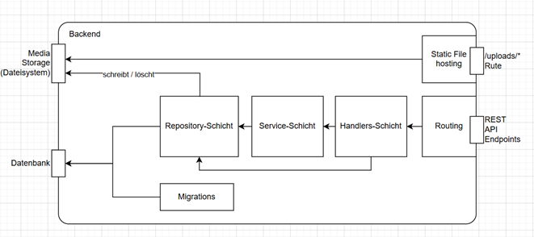

**Baustein Site-Generator**
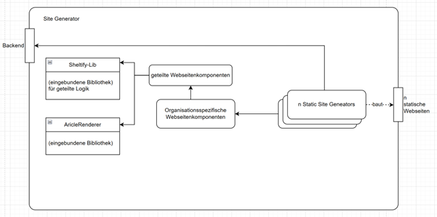

**Baustein CMS-Oberfläche**
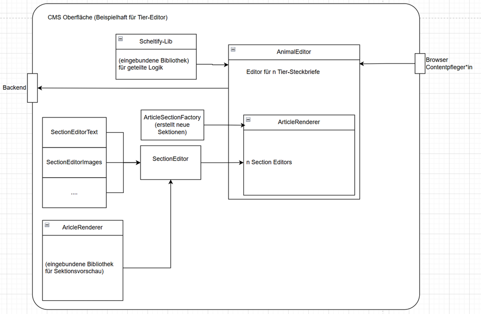

## Laufzeitsichten

**Tier anlegen**
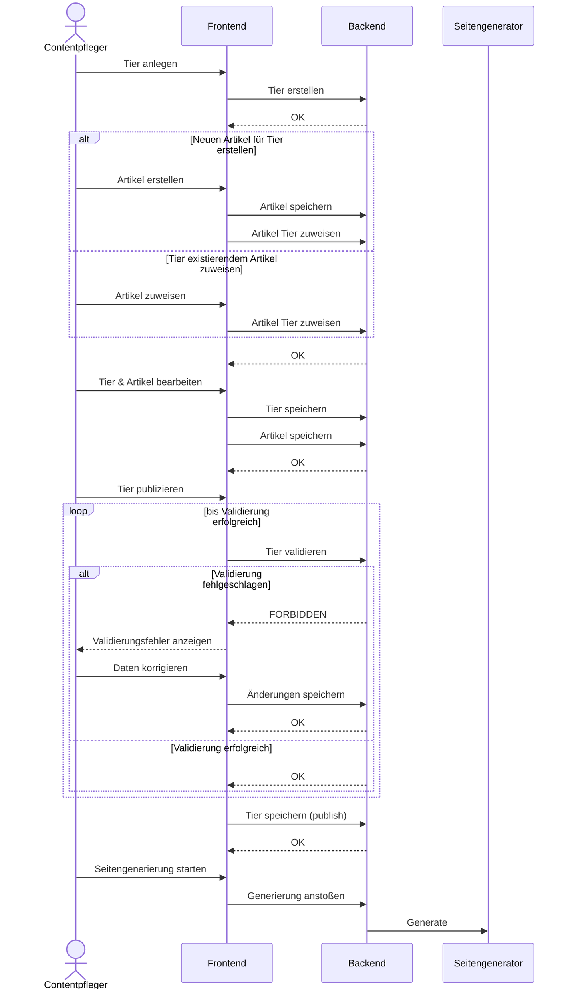
  

**Artikelsektion anlegen**
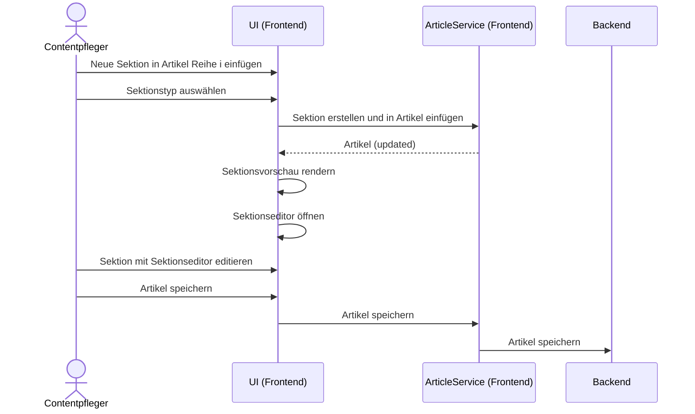

  

**Organisationsdaten bearbeiten**
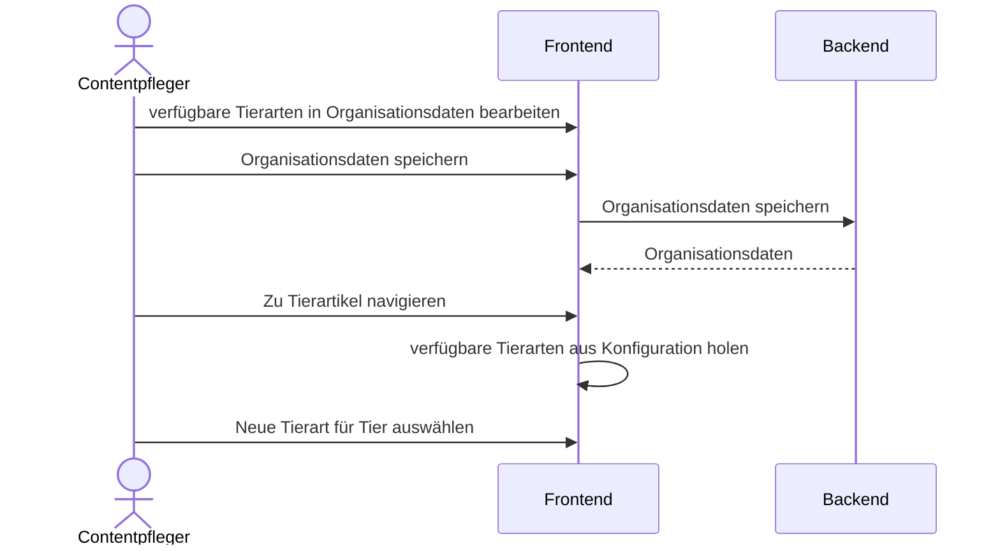

  

**Bilder hochladen**
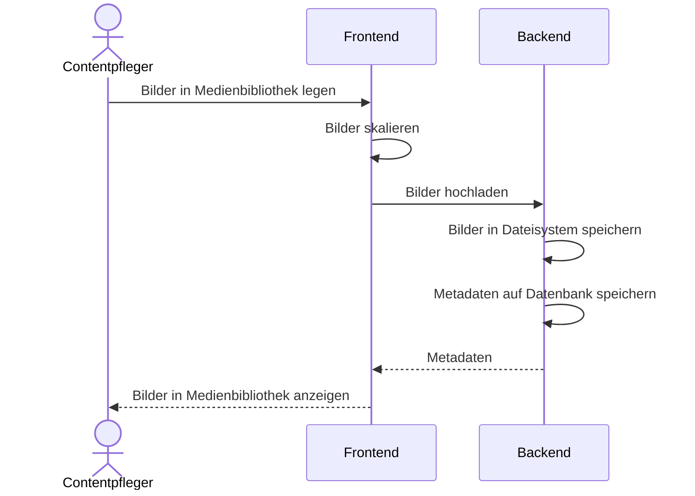

  

**Entwickler legt neue Organisation an**
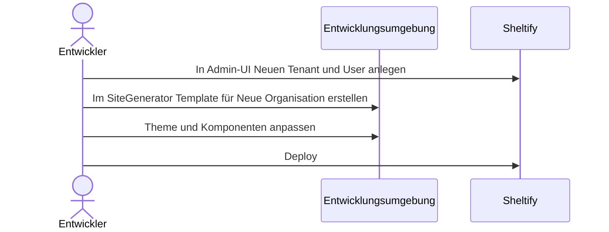

## Verteilungssicht
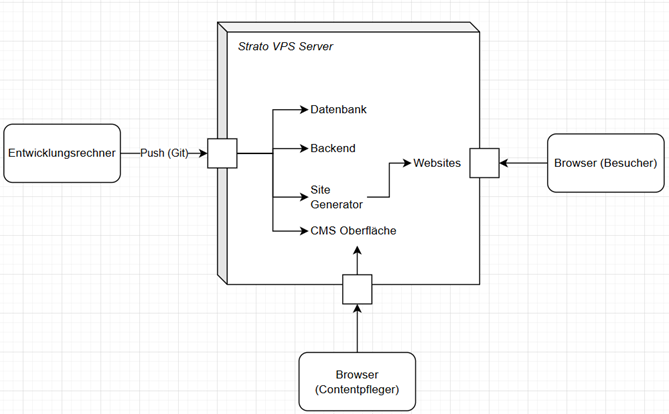

## Querschnittliche Konzepte
**Artikelrenderer**
Der Artikelrenderer wird sowohl von CMS-Oberfläche, als auch vom Site Generator verwendet (siehe Zerlegung). Ein Artikel besteht aus verschiedenen Sektionen, die untereinander dargestellt werden. Jede Sektion hat einen bestimmten Typ z.B. Text, Bild(er) oder Tierliste und wird demensprechend von einem anderen „SektionRenderer“ behandelt. In der CMS-Oberfläche gibt es zudem noch einen „SectionEditor“ für jeden Sektionstyp, der eine Benutzerfreundliche Oberfläche der entsprechenden Sektion bereitstellt.
Einen Spezialfall stellt hier die „Columns“ Sektion dar, die Mehrspaltigkeit erlaubt und mehrere Sektionen über bis zu 4 Spalten einbindet. Geschachtelte „Columns“ sind jedoch nicht erlaubt.
Des Weiteren gibt es einen „SpecialSection“ Typ, für Sektionen die nicht allgemein verfügbar sind sondern nur für eine bestimmte Organisation.  Für diese Typen wird vom Seitengenerator pro Organisation ein Schema bereitgestellt, welches dann in der CMS-Oberfläche als Sektionstyp (mit einem allgemeinen Sektionseditor) verfügbar ist.

**Sheltify-Lib**
Sheltify-Lib ist eine TypeScript Library, welche Funktionalitäten und Typen bereitstellt, die von CMS-Oberfläche, Artikelrenderer und Seitengenerator gemeinsam benutzt werden.

**Testing**
Für den MVP werden vorerst nur E2E Tests (PlayWright) verwendet. Diese bieten hier mit einfachen Mitteln eine Abdeckung großer Teile des Systems. Anstoßen der Tests baut einen nur dafür ausgelegten Datenbankcontainer komplett neu, startet das Backend mit entsprechender Verbindung und legt Testorganisation und User an.
Unittests sind aufgrund des erhöhten Aufwands bei der kleinen der Teamgröße (1 Entwickler) vorerst nicht vorgesehen.

**Security**
- Die vom Site-Generator generierten Seiten sind rein statisch und benötigen daher keine Maßnahmen, die über den von Strato bereitgestellten Schutz hinausgehen.
- Die CMS-Oberfläche und das verbundene Backend sind über klassische Authentifizierung über Session- und Csfr Tokens geschützt. Erstellung neuer Nutzer ist nur für den Administrator über einen geheimen API Key möglich.
- In jedem Endpoint ist sichergestellt, dass Nutzer nur Daten ihrer eigenen Organisation bearbeiten können
- Datenbank und Seitengenerator sind nur vom Server aus selbst vom Backend erreichbar.

## Architekturentscheidungen

**Verwendung von statischer, statt dynamischer Single Page Applications für die bereitgestellten Webseiten**
Um die Webseiten der verschiedenen Organisationen bereitzustellen wurden zwei Möglichkeiten in Betracht gezogen
1. | Single Page Applications mit Angular – dynamische Befüllung der Inhalte vom Backend
2. | Statische Generierung der Seiten mit AstroJS ohne direkte Anbindung der generierten Seiten ans Backend 

Option 1 bietet folgende Vor- und Nachteile:

`+` Gleiche Technologie wie CMS-Oberfläche → einfache Wiederverwendung von Code
`+` Erfahrung mit Angular des Hauptentwicklers
`+` Seite ist immer aktuell und muss nicht neu gebaut werden
`-` Hohe Serverlast, da Frontend die Daten ständig neu anfragt
`-` SEO bei Single Page Applications out oft the box schlecht
`-` Schlechtere Client-Performance, da Rendering (json zu html) im Browser des Nutzers passiert

Option 2 bietet folgende Vor- und Nachteile:
`+` Geringe Serverlast, da Seiten rein statisch ausgeliefert werden und Backend nicht anfragen
`+` Gutes SEO out oft the Box
`+` Gute Performance im Browser da wenig JavaScript ausgeführt werden muss
`-` Wenig Erfahrung des Hauptenwicklers mit gängigstem Framework AstroJS
`-/+` Seiten müssen neu gebaut werden bevor der Inhalt aktualisiert wird – kann auch Vorteil sein da es so by-design möglich ist Änderungen zu machen, die noch nicht sofort auf der Webseite erscheinen sollen.

Aufgrund der zuvor definierten Qualitätsziele wurde Option 2 gewählt.

**Gemeinsame Nutzung des Artikelrenderers für CMS-Oberfläche und Site Generator**
Für die Vorschau der Artikel wurden zwei Varianten untersucht
1. Nutzung einer gemeinsamen „Library“ zum Rendering der Artikelsektionen für CMS-Oberfläche und Site Generator
2. Keine Vorschau in CMS-Oberfläche, stattdessen „Preview“ Funktion über Sitegenerator.
Option 1 war hier von Anfang an zu bevorzugen, jedoch war die technische Machbarkeit nicht klar. Option 2 ist für Contentpfleger und Performance nicht komfortabel, da sie immer den Site-Generator anstoßen müssten um eine Vorschau ihrer Seiten zu bekommen. Sobald der technische Durchstich mit Svelte erfolgreich war, wurde Option 1 also endgültig entschieden.

Option 1 war hier von Anfang an zu bevorzugen, jedoch war die technische Machbarkeit nicht klar. Option 2 ist für Contentpfleger und Performance nicht komfortabel, da sie immer den Site-Generator anstoßen müssten um eine Vorschau ihrer Seiten zu bekommen. Sobald der technische Durchstich mit Svelte erfolgreich war, wurde Option 1 also endgültig entschieden.

## Qualitätsanforderungen
Wichtigste Qualitätsanforderung siehe *Qualitätsziele*

| Qualitätsanforderung | Motivation und Erläuterung |
| - | - |
| Möglichst gleiche Darstellung von Artikeln auf generierten Seiten und in CMS-Oberfläche | Um den Contentpfleger*innen die Bearbeitung von Artikeln möglichst einfach zu machen sollte die Darstellung so ähnlich wie möglich sein. |
| Dokumentation in CMS-Oberfläche | Statt einer separaten Dokumentation der CMS Funktionalitäten wird (dort wo nötig) eine Dokumentation in der Oberfläche selbst angestrebt um die Nutzung zu vereinfachen. |
| Mobile First Design der generierten Seiten | Es hat sich gezeigt, dass die meisten Besucher (von streunrnothilfe-grenzenlos.de) Mobilgeräte nutzen |
| Mobile Second Design der CMS-Oberfläche | Contentpflege geschieht meist über Laptop/PC, einfache Anpassung von Inhalten soll aber trotzdem auch per Handy möglich sein. |
| Effiziente Verwaltung von Mediendateien | Es soll ein Tag-System eingeführt werden, über das Bilder einfach sortiert oder bestimmten Tieren zugeordnet werden können |
| Effiziente Bereitstellung von Mediendateien | Mediendateien sollen in verschiedenen Größen und im webP Format bereitgestellt werden, um effiziente Einbindung zu ermöglichen |
| Möglichkeiten für SEO bieten | SEO Relevante Einstellungen (Beschreibung etc.) soll für jede Seite möglich sein |
| Suche auf Websites | Es soll Besuchern möglich sein die Statisch generierten Webseiten zu durchsuchen |

**Qualitätsbaum**
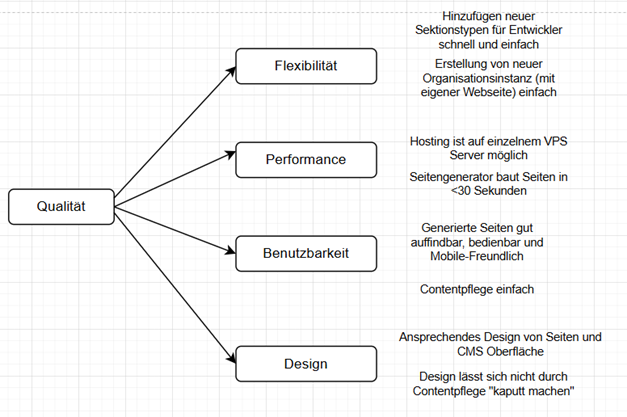

**Qualitätsszenarien**
F1  Entwickler kann Design der Überschriften einer Webseite ohne Aufwand anpassen und ohne Webseiten anderer Organisationen zu beeinflussen  

F2  Entwickler kann die Logik des Headermenüs für alle Webseiten gleichzeitig anpassen  

F3  Entwickler kann auf Nachfrage einer Organisation eine speziell auf sie zugeschnittenen Sektionstyp (z.B. „Sponsoren“-Karte) für Artikel hinzufügen, der nur für diese Organisation verfügbar ist.  

P1  Speicherplatz des Servers wird mit initialem Content von 3 Webseiten nicht über 1/3 ausgeschöpft  

P2  Ladezeit der Webseiten <1 Sekunde  

P3  Seitengenerator baut Seite in <30 Sekunden  

B1  Contentpfleger findet ohne externe Anleitung heraus wie er neue Tiere anlegen kann  

B2  Contentpfleger kann einfach kontrollieren welche Seiten im Header angezeigt werden, in welcher Reihenfolge und welche nicht  

B3  Contentpfleger hat schon vor dem Publizieren eines Artikels eine gute Vorschau davon, wie er auf der Webseite aussehen wird  

D1  Webseitenheader springt für mobile Anwendung auf „Burger“ Menü um  

D2  Mehrspaltige Sektionen springen bei mobiler Anwendung auf vertikales Layout  

